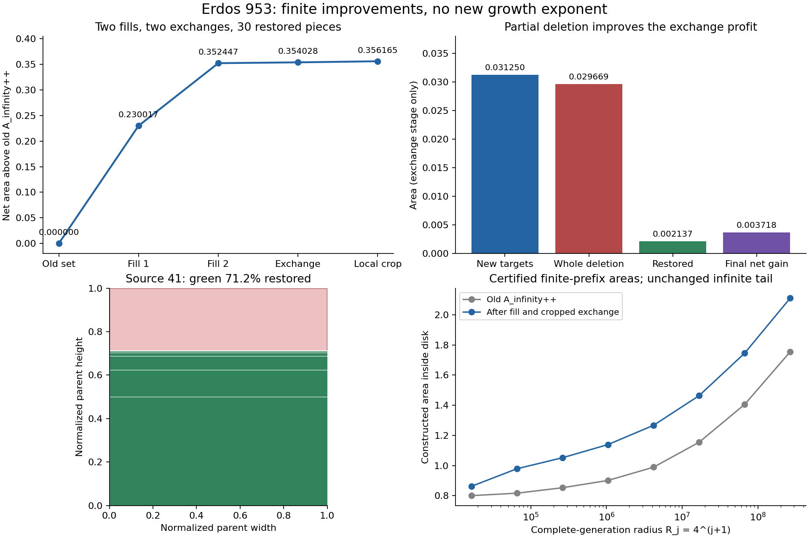

# Erdős 953 research progress — 2026-10-03

This snapshot records the constructions, experiments, exact certificates and
independent audits prepared by this project with Codex assistance. The current
Lean theorems are in the repository root; Python audit results here are not Lean
formalizations. Search output is not evidence of a global optimum.

## Current results

- The Lean proof gives, for every real `R >= exp(1)`,
  `Mopen(R) >= sqrt(R)/(32768*sqrt(10))*(log(log(R))/log(R))^3`, together
  with an explicit lower bound for every positive radius. See
  [the formalization audit](erdos953-sharp-formalization-audit-2026-10-03.json).
- A separately audited fixed unbounded construction retains coefficient
  `1/55296` in the same expression for every real `R >= exp(1)`. Its
  infinite tail is treated analytically, not truncated.
- Two sequential full-integer-annulus fills add area
  `461959/1310720`. Two exchanges followed by partial restoration add a further
  `17660126586983/4749890231992320`. The combined net addition above the
  preceding fixed construction is
  `1691743486634087/4749890231992320`, approximately `0.3561647541325377`.
  It applies as a complete additive gain for every `R >= 268435456`.
  These modifications preserve the uniform bound but do not improve its
  asymptotic order. See [the proof and limitations](erdos953-iterated-fill-exchange-notes-2026-10-03.txt)
  and [the certificate summary](erdos953-iterated-fill-exchange-summary-2026-10-03.json).
- Small-radius square, triangular, hexagonal and octagon-square searches give
  explicit constructive lower bounds. Outer-cell covering, spectral, theta,
  moment and adaptive-subdivision experiments have not established a new
  continuous asymptotic upper bound. The
  [current result index](erdos953-current-certified-lower-bounds-2026-10-03.json)
  identifies the individual certificates and the status of each result.

The square-root upper-bound formalization belongs to Allen Hart; its pinned
source is fetched by `scripts/prepare_hart.py`, as described in the main
[README](../README.md). It is not included in this research snapshot.
The digit-construction provenance is also described there. We do not claim an
exact extremal area, a `Theta(sqrt(R))` theorem, or prize eligibility.



## Full snapshot and reproducibility

The [complete compressed snapshot](archives/erdos953-research-snapshot-2026-10-03.zip)
contains all Erdős 953 research files selected from the workspace, including the
earlier raw experiment certificates. The
[manifest](snapshot-manifest-2026-10-03.json) records the archive hash and the
SHA256 and size of every file. Code, notes, audit reports and the latest
lower-bound certificates are also directly browsable alongside this README.

Run `python scripts/check_research_snapshot.py` from the repository root to
check the archive hash and all directly browsable snapshot files. Git preserves
their exact original bytes on every platform via `.gitattributes`.

Extract the ZIP into a new scratch directory. For the latest exchange result,
run the following there in order using Python 3.12; these three independent
auditors use the standard library:

```sh
python verify_953_iterated_ring_holes.py erdos953-iterated-ring-holes-exchange-input-2026-10-03.json
python verify_953_ring_exchange.py
python verify_953_exchange_restoration.py
```

The existing base-construction audit is a hash-checked dependency of the first
command. `verify_953_infinite_ring_extension.py` contains its original audit
implementation. The latest auditors also check the analytic future tail.
An unchanged, byte-identical input has a reused audit explicitly identified in
the multiscale report.

The proposal and plotting scripts additionally use NumPy, SciPy, Numba,
Matplotlib, Shapely, CVXPY, Clarabel, NetworkX and threadpoolctl as applicable.
They are optional for checking the latest exact exchange certificates. Some
optimization experiments are expensive; use their recorded command options
and distinguish heuristic proposal output from independent exact audits.

The formal Lean result is verified separately with `lake build Erdos953Growth`
using the pinned dependencies and attributed Hart source described in the
main README.
