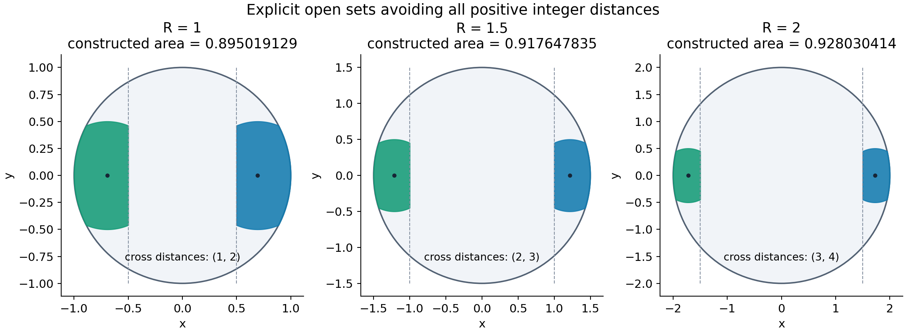
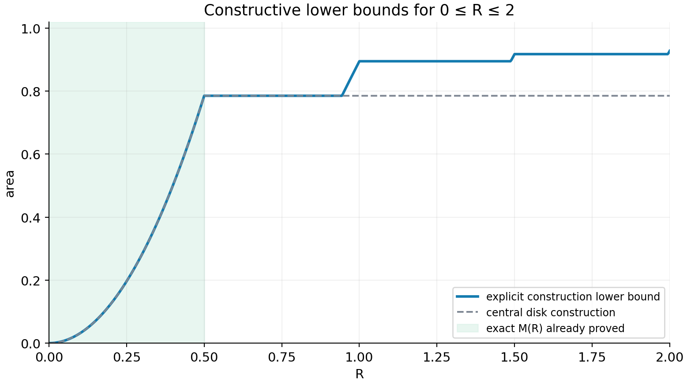

# JSP-000793 / Erdős #953：小半径的精确构造

日期：2026-10-03。本轮研究 `R=1,3/2,2` 及 `0≤R≤2` 的连续半径范围。

这里区分三件事：原极值 `M(R)` 的精确值、一个明确构造的精确面积，以及在
明确限制的构造类中的最优面积。本轮没有证明 `M(1)`、`M(3/2)` 或 `M(2)` 的精确值。

## 1. 已有精确极值与本轮结果

已有 Lean 结果：

\[
M(R)=\pi R^2,\qquad 0\le R\le\tfrac12.
\]

本轮得到两个左右对称叶片的明确构造，具有以下**精确面积公式的数值**：

| 半径 R | 最优中心参数 c（指定端帽类） | 构造面积 L(R) |
|---|---|---:|
| 1 | `(1+√10)/6` | 0.895019129190102572637921550828… |
| 3/2 | `(1+√7)/3` | 0.917647834962326652028145869004… |
| 2 | `(1+√6)/2` | 0.928030414065413973921442844280… |

因此 `M(R)≥L(R)`。这三个面积都大于中央半径 `1/2` 圆盘的面积
`π/4=0.785398163397448…`，在 `R=1` 时提高约 13.96%。



图中的边界用于显示几何形状，均不包含在开集内。

## 2. 用一个公式定义整个构造

对半整数半径 `R=m/2`（整数 `m≥2`），令

\[
t=R-\tfrac12,
\qquad
c=\frac{t+\sqrt{t^2+3(R^2-\tfrac14)}}3
=\frac{R-\tfrac12+\sqrt{4R^2-R-\tfrac12}}3.
\]

定义开集

\[
\boxed{
A_R=\{(x,y):\ x^2+y^2<R^2,\quad
(|x|-c)^2+y^2<\tfrac14,\quad |x|>t\}.
}
\tag{1}
\]

右叶是半径 `1/2`、中心 `(c,0)` 的开圆盘与大圆盘、右端帽 `x>t` 的交集；
左叶是其关于纵轴的反射。

**排除所有正整数距离的证明很短：**

- 同一叶的两点都在同一个半径 `1/2` 开圆盘内，距离严格小于 `1`。
- 跨叶两点的横向距离严格大于 `2t=m−1`，欧氏距离也严格大于 `m−1`。
- 所有点位于半径 `R=m/2` 的开圆盘内，所以任意两点距离严格小于 `m`。

所以跨叶距离均在 `(m−1,m)` 内：`R=1` 对应 `(1,2)`，`R=3/2` 对应 `(2,3)`，
`R=2` 对应 `(3,4)`。这不是通过抽样排除整数距离，而是对所有点成立的区间证明。

## 3. 面积闭式

令

\[
\delta=c-t,\quad q=2c-t=t+2\delta,\quad
h=\sqrt{\tfrac14-\delta^2}=\sqrt{R^2-q^2}.
\]

两个圆的上半圆弧在 `x=q` 相交。对 `t<x<q`，右叶的半高度是
`√(1/4−(x−c)²)`；对 `q<x<R`，半高度是 `√(R²−x²)`。因此

\[
L(R)=4\int_t^q\sqrt{\tfrac14-(x-c)^2}\,dx
+4\int_q^R\sqrt{R^2-x^2}\,dx.
\]

化简为

\[
\boxed{L(R)=\arcsin(2\delta)+2R^2\arccos(q/R)-2t\sqrt{\tfrac14-\delta^2}.}
\tag{2}
\]

这里反三角函数取通常的主值，弧度制。特别地：

\[
\begin{aligned}
L(1)&=\arcsin\frac{\sqrt{10}-2}{3}
+2\arccos\frac{2\sqrt{10}-1}{6}
-\frac{\sqrt{4\sqrt{10}-5}}6,\\[2mm]
L(3/2)&=\arcsin\frac{2\sqrt7-4}{3}
+\frac92\arccos\frac{4\sqrt7-2}{9}
-\frac{\sqrt{16\sqrt7-35}}3,\\[2mm]
L(2)&=\arcsin(\sqrt6-2)
+8\arccos\frac{2\sqrt6-1}{4}
-\frac32\sqrt{4\sqrt6-9}.
\end{aligned}
\tag{3}
\]

这些是构造面积的精确表达式，不是对未知 `M(R)` 的近似猜测。

## 4. 不只是优化圆心：指定端帽、单位直径类的精确最优值

固定半整数 `R≥1` 和 `t=R−1/2`。考虑任意可测集

\[
B\subset \{(x,y):x^2+y^2<R^2,\ x>t\},\qquad \operatorname{diam}(B)\le1.
\]

令其几乎处处可测的竖直截线长度为 `ℓ(x)`。对可测的截线 `x,x'`，若两截线均非空，
所有跨截线的点对竖直差都不超过 `√(1−(x−x')²)`。取上下端点的上确界和
下确界后相加，得到

\[
\ell(x)+\ell(x')\le2\sqrt{1-(x-x')^2}.
\tag{4}
\]

不要求截线本身是区间，因为长度不超过其跨度。若一条截线为空，在本证明的
`|x−x'|≤R−t=1/2` 范围内，`ℓ≤1≤2√(1−(x−x')²)`，式 (4) 仍成立。

任取 `q∈[t,R]`，在 `[t,q]` 配对 `x'=t+q−x`，在 `[q,R]` 使用圆盘截线长度，
Fubini 给出

\[
|B|\le U(q):=
\int_t^q\sqrt{1-(2x-t-q)^2}\,dx
+2\int_q^R\sqrt{R^2-x^2}\,dx.
\tag{5}
\]

第一项等于中心 `c=(t+q)/2` 的半径 `1/2` 圆盘在对称条带 `[t,q]` 中的面积。
对 `q` 求导：

\[
U'(q)=2\left(\sqrt{\tfrac14-((q-t)/2)^2}-\sqrt{R^2-q^2}\right).
\]

两个平方的差在 `[t,R]` 严格单调，端点的符号相反，故 `U` 有唯一极小点。
其条件恰好是两个圆弧在 `q` 处相交；代入 `q=2c−t` 得

\[
3c^2-2tc-(R^2-\tfrac14)=0.
\]

正根正是第 2 节的 `c`。右叶 (1) 在 (5) 中达到等号，所以

\[
\boxed{\max_{B\ \text{如上}}|B|=L(R)/2.}
\]

由反射，左右两个指定端帽内、**每叶直径不超过 1** 的两叶类最大面积恰好是
`L(R)`。这个最优性证明不限于圆盘交集或对称截线，甚至不要求每个候选叶片凸。

限制仍然实质存在：原问题允许更多叶片、其他位置、以及不满足上述端帽分隔的构造。
因此该最优性不能推出 `M(R)=L(R)`，也没有排除其他两分量布局。

## 5. 连续半径范围，而不只是三个端点

对任意 `R>1/2`，选整数 `m=⌈2R⌉`，令 `t=(m−1)/2`。则 `2R≤m`，仍有跨叶
距离位于 `(m−1,m)`。

- 若 `R²−t²≤1/4`，完整端帽 `x>t` 的直径不超过 1，取两完整端帽即可。
  它们包含在中心 `±t`、半径 `1/2` 的圆盘内。
  精确面积为 `2[R² arccos(t/R)−t√(R²−t²)]`。
- 若 `R²−t²>1/4`，采用第 2 节的 `c` 和第 3 节的公式。
- 同时可以保留任意较小半径已有的构造；这样取所得下界的单调包络。

在 `0≤R≤2` 内，该包络的一些值如下：

| R | 已证明可构造的面积（闭式的数值） | 是否已经求得 M(R) |
|---|---:|---|
| 1/4 | π/16 = 0.1963495408… | 是，已有结果 |
| 1/2 | π/4 = 0.7853981634… | 是，已有结果 |
| 3/4 | 至少 π/4 | 否 |
| 1 | 至少 0.8950191291… | 否 |
| 5/4 | 至少 0.8950191291…，嵌入 R=1 的构造 | 否 |
| 3/2 | 至少 0.9176478349… | 否 |
| 7/4 | 至少 0.9176478349…，嵌入 R=3/2 的构造 | 否 |
| 2 | 至少 0.9280304140… | 否 |



图中平台只是当前构造的包络，不代表真实 `M(R)` 在这些区间保持常数。

## 6. 不依赖反三角函数求值的精确有理构造

另生成了三个由有理顶点定义的双叶多边形。面积本身是有理数：

| R | 多边形的精确面积 | 数值 |
|---|---|---:|
| 1 | `586555002834469/655360000000000` | 0.895011906180… > 0.895 |
| 3/2 | `37586551414283/40960000000000` | 0.917640415387… > 0.9176 |
| 2 | `152047293396509/163840000000000` | 0.928023030984… > 0.928 |

它们与相应闭式构造的面积只差约 `7.2–7.4×10⁻⁶`。

每个右叶有 257 个竖直截线结点 `xᵢ`，半高度为有理数 `hᵢ`；在结点间线性插值
得到连续函数 `H(x)`，取 `t<x<R, |y|<H(x)`，再反射得到左叶。

独立验证器对每个结点及每对结点逐项使用整数验证：

\[
x_i^2+h_i^2\le R^2,\qquad
(x_i-x_j)^2+(h_i+h_j)^2\le1.
\]

这些不等式证明所有顶点位于闭圆盘内、任意两个顶点距离不超过 1。线性插值区域
的每个点是有限个顶点的凸组合；欧氏范数和距离的凸性把结点条件推广到整个区域。
区域本身是开集，故其点不在大圆盘边界上，且同叶实际点对距离严格小于 1。
跨叶距离仍由两个半平面和大圆盘控制。因此验证器证明的是连续开集的合法性，
不是仅验证一批离散点。

程序共检查 `3×257²=198147` 个有序结点对。生成阶段使用数值线性规划寻找高度，
随后向下有理化；独立验算阶段不导入 SciPy，不使用浮点数、平方根或求解器。

证书：

- `erdos953-small-radius-R2-over-2-certificate.json`
- `erdos953-small-radius-R3-over-2-certificate.json`
- `erdos953-small-radius-R4-over-2-certificate.json`

复现（工作区根目录）：

```powershell
python research/erdos953_small_radius_constructions.py
python research/verify_953_small_radius_certificates.py
```

数值积分与闭式用 65 位精度独立核对，诊断误差小于 `10⁻⁵⁵`；这项数值检查不替代
第 3 节的解析积分证明。

## 7. Lean 核验的范围

`erdos953-lower-submission/Erdos953Lower/SmallRadiusLobes.lean` 已核验：

- 双叶集合是开集，因而可测；
- 集合包含在半径 R 的开圆盘；
- 同叶距离小于 1、跨叶距离位于 `(m−1,m)`；
- 对 `2R≤m, 2t=m−1` 的连续半径构造，排除所有正整数距离；
- 构造面积必然不超过独立定义的原极值 `Mopen R`。

半整数情况是上述定理的直接推论。面积的闭式积分、指定端帽类的最优性和多边形
插值证书的通用正确性尚未在 Lean 中形式化；后两者在本笔记中有独立证明。
公理审计只列 `propext`、`Classical.choice`、`Quot.sound`。最终版本
`lake build` 已成功（3441 jobs），没有新增证明占位符或自定义公理。复现命令：

```powershell
lake build Erdos953Lower.SmallRadiusLobes
```

## 8. 文献归属与仍待解决的问题

截圆盘思路有明确先例。Kurz–Mishkin 的
[Open sets avoiding integral distances](https://arxiv.org/pdf/1204.0403)
研究的是不限制容纳圆盘半径、限制连通分量数的极值，其 Corollary 2 给出
两分量面积上确界 `π/6+√3/4≈0.956611477…`。它不直接给出任何固定小半径的 `M(R)`。
本轮的目标是附加固定半径及端帽限制，给出可逐点描述、精确计量的构造。
没有声称已完成对固定半径公式的新颖性审查。

我们的半整数双叶面积随着半径增大趋向上述两分量上确界，但固定小半径仍有
圆盘边界造成的损失。研究下一步应检查其他两分量布局和三分量以上的构造能否
超过本轮下界，并寻找适用于**所有**可测集合的上界；仅优化当前双叶参数已无剩余空间。
